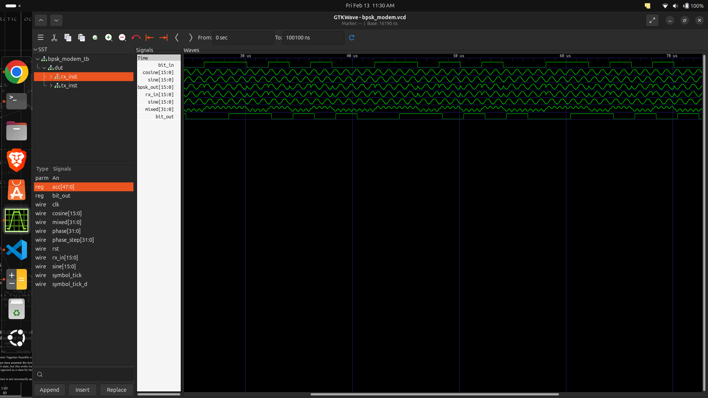

# BPSK Modem in Verilog

This repository contains a complete Binary Phase Shift Keying (BPSK) modem implemented in Verilog.  
The design includes both transmitter and receiver chains and uses a Direct Digital Synthesis (DDS) carrier generator based on a phase accumulator and CORDIC engine.

The implementation is intended for FPGA-based digital communication experiments and RTL design evaluation.

---

## BPSK Principle

Binary Phase Shift Keying is a phase modulation technique in which the phase of a carrier is shifted according to the input bit.

A continuous-time carrier can be expressed as s(t) = A cos(2πfct).  
In BPSK, the transmitted signal becomes s(t) = A cos(2πfct + πb), where b ∈ {0,1}.  
A bit value of 1 produces the nominal carrier phase, while a bit value of 0 produces a phase shift of 180 degrees.

---

## System Description

The modem consists of a digital transmitter and receiver.

The transmitter converts the input binary sequence into a phase-modulated carrier using a DDS-based oscillator.  
The receiver performs coherent demodulation by mixing the received signal with a locally generated carrier and recovering the transmitted bit from the baseband polarity.

---

## Repository Structure

BPSK_modem/

- top.v : Top-level modem integrating transmitter and receiver
- bpsk_tx.v : BPSK transmitter
- bpsk_mod.v : Phase inversion logic
- rx.v : BPSK receiver
- phase_acc.v : Phase accumulator used for DDS
- cordic.v : CORDIC-based sine and cosine generator
- delay.v : Pipeline alignment block
- cordic_tb.v : Testbench for CORDIC verification
- sim/ : Simulation-related files
- bpsk.vcd, bpsk_modem.vcd : Simulation waveforms

---

## Module Descriptions

### top.v
Top-level integration module. It connects the transmitter, receiver, clock, reset, and internal data paths to form a complete modem.

### bpsk_tx.v
Implements the BPSK transmitter. The input bit controls the phase polarity of the generated carrier. The transmitter uses the phase accumulator to generate the carrier phase and the CORDIC engine to produce the corresponding sinusoidal waveform.

### bpsk_mod.v
Contains the phase inversion logic. The carrier is multiplied by +1 or −1 depending on the input bit, producing the required phase shift.

### phase_acc.v
Implements the DDS phase accumulator. The phase is updated according to the discrete-time relation phase[n+1] = phase[n] + phase_step. This produces a digital oscillator whose frequency depends on the phase step value.

### cordic.v
Implements a CORDIC-based sine and cosine generator. It converts the accumulated phase into sinusoidal samples without using hardware multipliers.

### delay.v
Provides signal alignment to compensate for pipeline latency between processing stages.

### rx.v
Implements the coherent BPSK receiver. The received signal is mixed with a locally generated carrier, producing a baseband component. The polarity of this component determines the recovered bit.

### cordic_tb.v
Testbench for verifying the correctness of the CORDIC sine and cosine outputs.

---

## Carrier Frequency Control

The carrier frequency is controlled by the parameter phase_step in phase_acc.v.

The output frequency is given by the DDS relation  
f_out = (phase_step × f_clk) / 2^N,  
where f_clk is the system clock and N is the phase accumulator width.

Increasing phase_step increases the carrier frequency, while decreasing it lowers the frequency.

---

## Clock Frequency Changes

If the system clock changes, the phase step must be recalculated.  
The scaling relation is  
new_phase_step = old_phase_step × (new_clk / old_clk).

---

## Example Calculation

Assume a 50 MHz system clock, a 32-bit phase accumulator, and a desired carrier frequency of 1 MHz.  
The required phase step is given by  
phase_step = (1 MHz × 2^32) / 50 MHz ≈ 85899346.

---

## Simulation

Using Icarus Verilog:

Compile the design:  
iverilog -o bpsk_sim *.v

Run the simulation:  
vvp bpsk_sim

View the waveform:  

gtkwave bpsk_modem.vcd

---

## Simulation Result : 

The waveform shows the phase inversion of the carrier corresponding to the input bit sequence, confirming correct BPSK modulation and demodulation.

---

## FPGA Implementation

1. Synthesize top.v.
2. Assign clock and reset pins.
3. Route the output to a DAC or GPIO.
4. Observe the waveform using measurement equipment.

